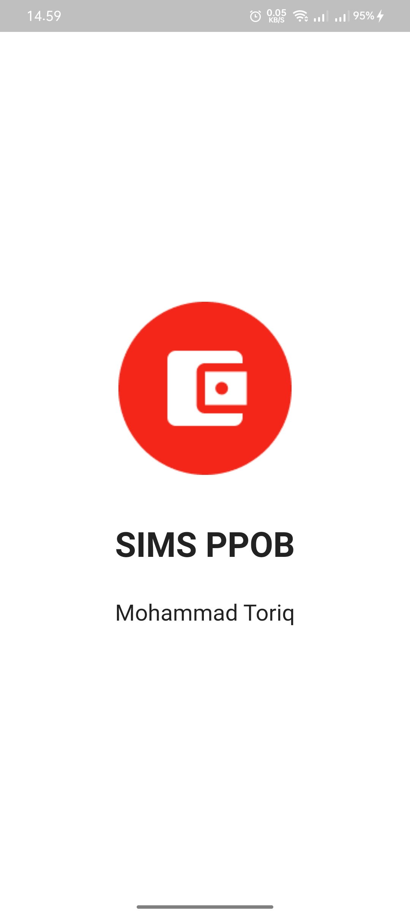
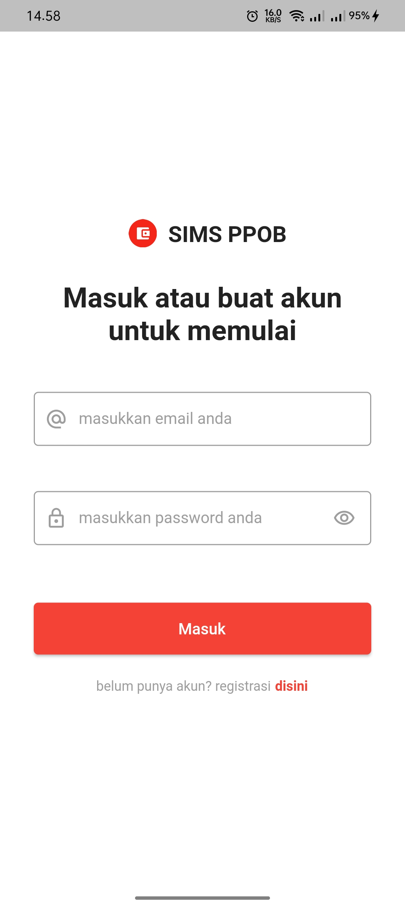
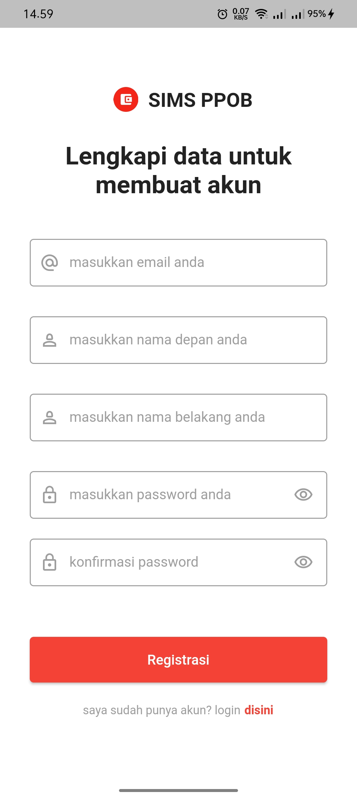
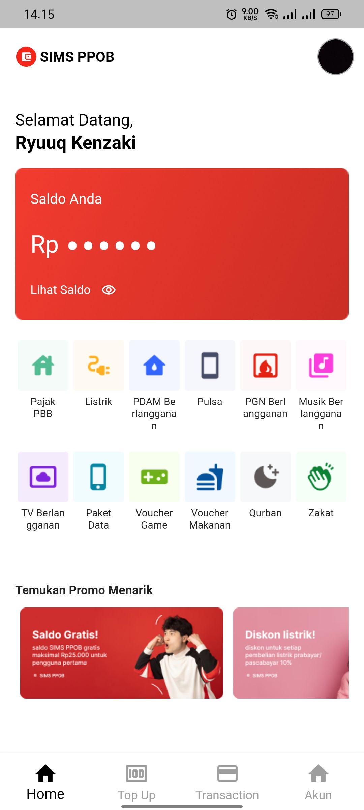
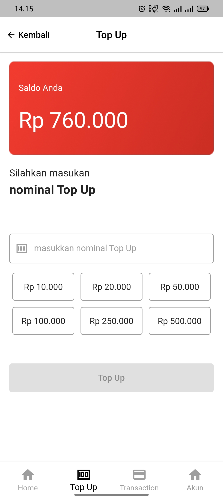
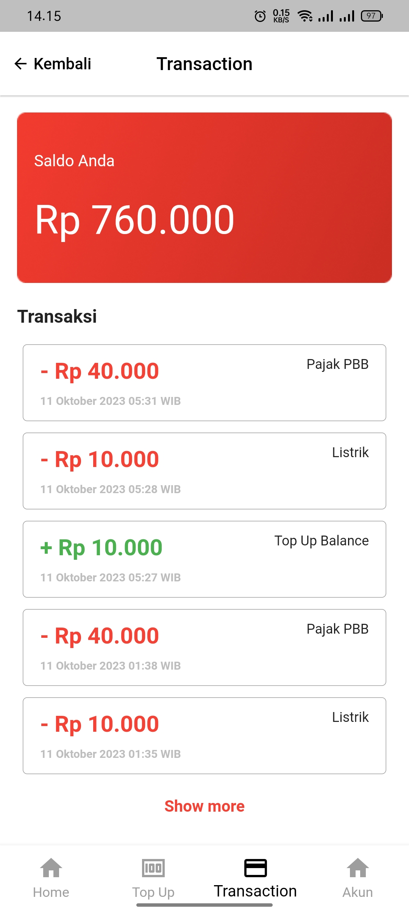
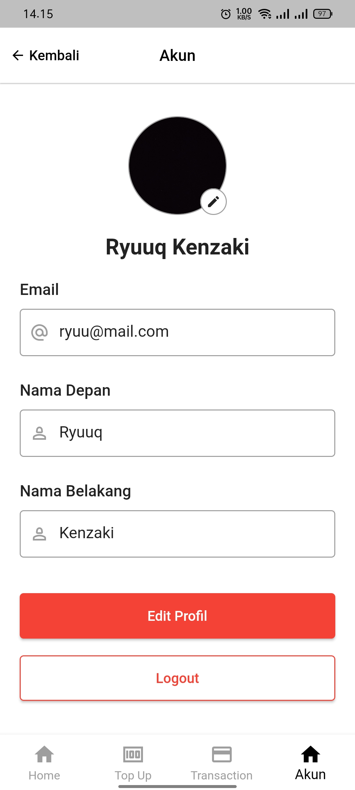
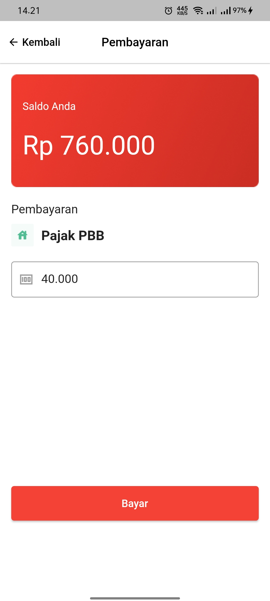
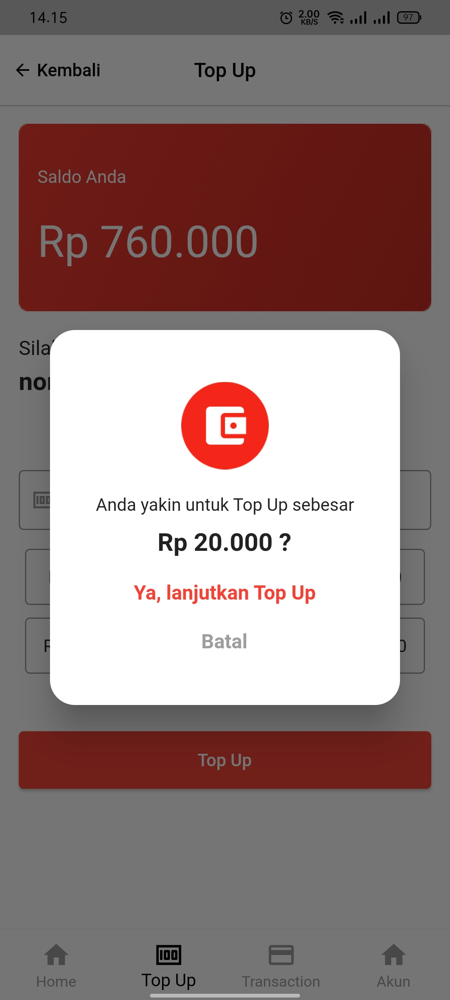

## Tentang Aplikasi

SIMS PPOP adalah aplikasi latihan untuk simulasi PPOB. Aplikasi ini dibangun menggunakan framework flutter.Aplikasi ini memiliki beberapa fitur :
- [x] Fitur Login
- [x] Register
- [x] Update Profile
- [x] Pembayaran PPOB
- [x] Top Up Saldo
- [x] Riwayat Transaksi

## Preview Aplikasi

